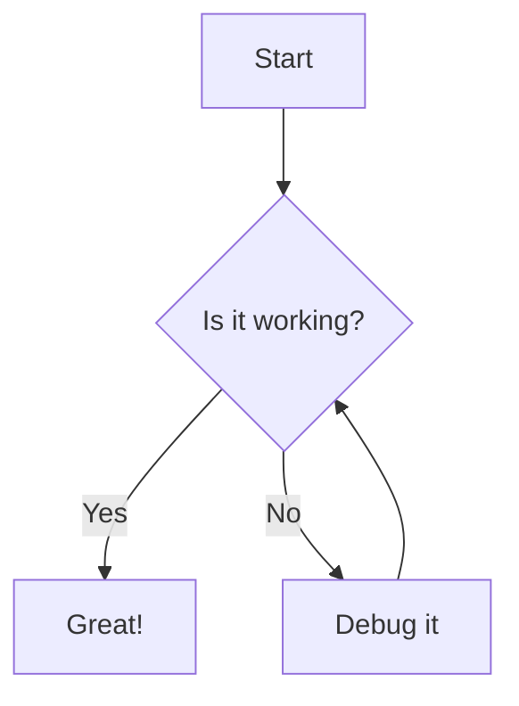
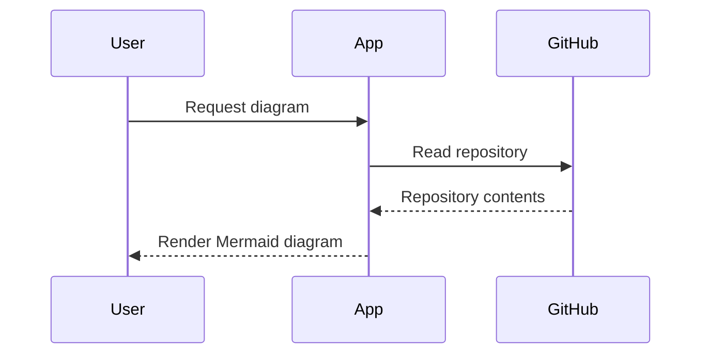
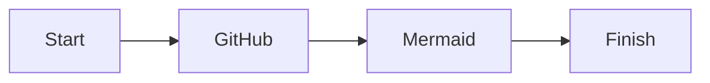

# Mermaid Test 1

A simple Mermaid.js test repository.

## Flowchart

```mermaid
flowchart TD
    A[Start] --> B{Is it working?}
    B -->|Yes| C[Great!]
    B -->|No| D[Debug it]
    D --> B
```

## Sequence diagram

```mermaid
sequenceDiagram
    participant U as User
    participant A as App
    participant G as GitHub

    U->>A: Request diagram
    A->>G: Read repository
    G-->>A: Repository contents
    A-->>U: Render Mermaid diagram
```

## Clickable nodes

Try clicking the **GitHub** or **Mermaid** nodes below.

```mermaid
flowchart LR
    A[Start] --> B[GitHub]
    B --> C[Mermaid]
    C --> D[Finish]

    click B "https://github.com" "Open GitHub"
    click C "https://mermaid.js.org" "Open Mermaid"
```
