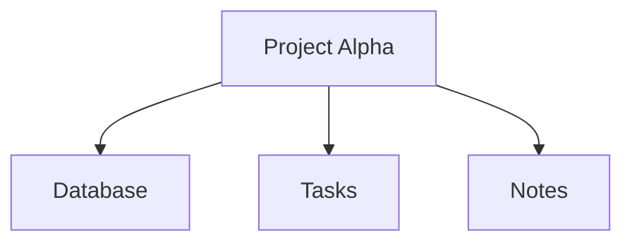
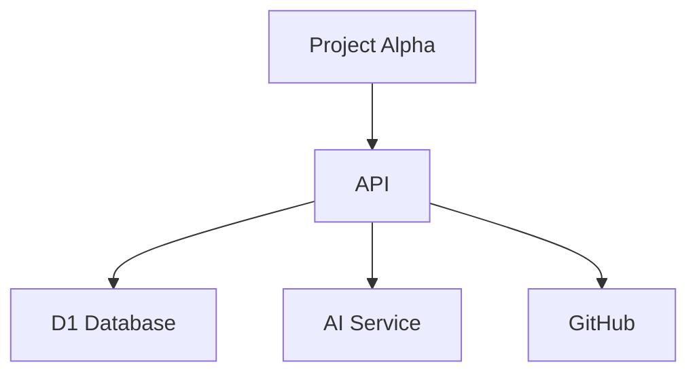
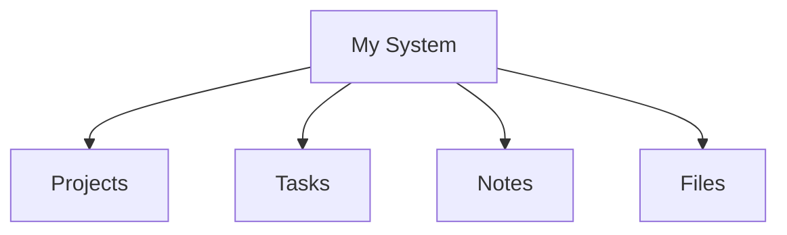

# Interactive Mermaid: Cards, Hover, and Context Actions

This file demonstrates a pattern for turning Mermaid diagrams into an interactive UI.

The key idea is:

- Mermaid defines the **relationships and visual structure**.
- JavaScript handles **interaction**.
- D1 (or another database) provides the **node data**.

## 1. Click a node to show a card



In the web application, the Mermaid click callback can call JavaScript:

```javascript
function showCard(id) {
  // Example: fetch the node's data from your API / D1
  // fetch(`/api/node/${id}`).then(...)

  console.log("Show card:", id);
}
```

The application can then display a normal HTML card/modal beside the diagram.

Example:

```text
┌──────────────────────────────┐
│ Project Alpha                │
│──────────────────────────────│
│ Status: Active               │
│ Tasks: 17                    │
│ Notes: 8                     │
│                              │
│ [Open] [Edit] [Ask AI]       │
└──────────────────────────────┘
```

## 2. Hover cards / tooltips

Mermaid renders the diagram as SVG. After rendering, JavaScript can attach mouse events to the generated SVG nodes.

Conceptually:

```javascript
// Conceptual example - inspect the generated Mermaid SVG
// and attach mouseenter / mouseleave handlers to nodes.

node.addEventListener("mouseenter", () => {
  showCard(nodeId);
});

node.addEventListener("mouseleave", () => {
  hideCard();
});
```

This allows a node to behave like a live data object:

```text
             ┌───────────────────────┐
             │ Project Alpha         │
             │ Status: Active        │
             │ 17 tasks              │
             │ 8 notes               │
             └───────────┬───────────┘
                         │
                    ┌────▼─────┐
                    │ Project  │
                    │ Alpha    │
                    └──────────┘
```

For a real application, the card contents can come from D1 through an API endpoint.

## 3. Right-click / context menu

A custom context menu can provide actions for a node:

```text
Project Alpha
    │
    ├── Open
    ├── Edit
    ├── Add Task
    ├── Add Note
    ├── Ask AI
    ├── Show Dependencies
    └── Delete
```

This is especially useful if Mermaid becomes the visual navigation layer of a personal system.

## 4. Node IDs can represent database objects

Instead of putting all metadata into the Mermaid text, keep the Mermaid diagram relatively small and let node IDs point to records.

For example:



The application can map those IDs to D1 records:

```text
Mermaid node
     │
     ▼
project:123
     │
     ▼
    D1
     │
     ▼
{ name: "Project Alpha",
  status: "active",
  tasks: 17,
  notes: 8 }
```

## 5. Click a node to navigate to another diagram

A node does not have to open a conventional web page. It can change the current diagram or drill into a more detailed view.

High-level view:



Then the application could replace the diagram with:

```text
Projects
   │
   ├── Project Alpha
   ├── Project Beta
   ├── Project Gamma
   └── Project Delta
```

Clicking Project Alpha could drill down again:

```text
Project Alpha
   │
   ├── Backend
   ├── Frontend
   ├── Database
   ├── Tasks
   └── Documentation
```

This creates a diagram-based navigation system.

## 6. Recommended architecture

Keep the responsibilities separated:

```text
                 Mermaid source
                       │
                       ▼
                Mermaid renderer
                       │
                       ▼
                     SVG
                       │
             interaction / events
                       │
                       ▼
                 Your web app
                 /     |      \
                /      |       \
             cards   menus   navigation
                \      |       /
                 \     |      /
                       ▼
                      D1
```

Mermaid is responsible for the **visual graph**. Your application is responsible for the **experience around the graph**.

That separation keeps the system flexible.

## 7. The interesting part: AI + Mermaid + D1

For a personal system, an AI could generate or update Mermaid source from a natural-language request.

For example:

> Show me how Project Alpha's backend is connected.

The AI could produce:


The same application can then:

1. Store the Mermaid source in D1.
2. Render it with Mermaid.js.
3. Show live cards when nodes are clicked or hovered.
4. Navigate between diagrams.
5. Let AI update the diagram when the underlying system changes.

That turns Mermaid from just **documentation** into a lightweight **visual interface to structured data**.

## Important note

The `click ... call ...` examples require Mermaid configuration that permits JavaScript callbacks. In a real application, treat Mermaid source as application data and validate/sanitize anything that can execute JavaScript. For trusted, single-user data this can be straightforward, but it is still worth designing deliberately.
